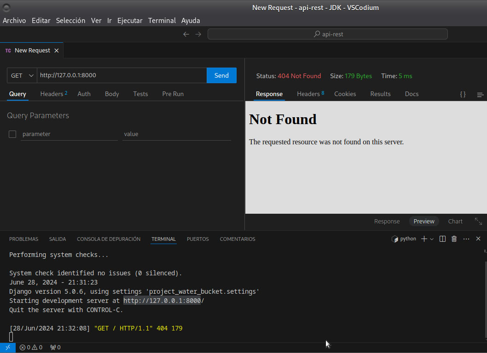

# Water bucket challenge 2024

## Desafío de los cubos de agua empleando python
    Esta solucion utiliza el framework de desarrollo Django y modulo django rest framework.

### Estructura del proyecto

* api-rest
	+ modules
		- Archivo.py
	+ project_water_bucket
		- Archivos.py
	+ water_bucket
		- Archivos.py
    - README.md
    - requirements.txt
## Descripcion de directorios
- **Modules/ ->** *incluye el modulo `water_bucket.py` esencial para realizar los calculos respectivos.*

- **project_water_bucket/ ->** *incluye Archivos generales para el funcionamiento de Django.*

- **water_bucket/ ->** *desarrollo de puntos finales.*

# Configuración del proyecto API-Rest

- Paso 1: Descargar o Clonar el Proyecto

        Descargue o clone el proyecto en su máquina local.

- Paso 2: Navegar al Directorio del Proyecto

        Navegue hasta el directorio `/api-rest` del proyecto.

- Paso 3: Crear y Activar un Entorno Virtual

        Cree un entorno virtual para ejecutar e instalar dependencias.

#### Linux y macOS

* Crear entorno: `python -m venv venv`
* Activar entorno: `source venv/bin/activate`
* Instalar requisitos: `pip install -r requirements.txt`

#### Windows

* Crear entorno: `python -m venv venv`
* Activar entorno:
	+ Símbolo del sistema: `venv\Scripts\activate`
	+ PowerShell: `venv\Scriptsactivate.ps1`
* Instalar requisitos: `pip install -r requirements.txt`

para verificar que el entorno se ha iniciado correctamente se debe parecer a esto:
`(venv) nombre-usuario@dominio:~/Descargas/api-rest$ `

**Esta todo en orden para iniciar la aplicacion**
- Crear las migraciones correspondientes para inicializar la DATA BASE.
    * `python manage.py makemigrations`
    * `python manage.py migrate`

- Ejecutar el servidor
    `python manage.py runserver`

# Como utilizar  `http://127.0.0.1:8000`
 - Ruta inicial: GET - `http://127.0.0.1:8000/api`
  Response = 
    `{"water-bucket": "http://127.0.0.1:8000/api/water-bucket/"}`

 - water-bucket/ : 
        POST - `http://127.0.0.1:8000/api/water-bucket/`

    **Cuerpo de la peticion en el siguiente formato**
        payload = {
                        "x":2,
                        "y":100,
                        "z":96
        }

    **Result:**

            `{
                "Solution": [
                                {
                                "step": 1,
                                "bucketX": 0,
                                "bucketY": 100,
                                "action": "Llenar cubo Y"
                                },
                                {
                                "step": 2,
                                "bucketX": 2,
                                "bucketY": 98,
                                "action": "Transferir del cubo X al Y"
                                },
                                {
                                "step": 3,
                                "bucketX": 4,
                                "bucketY": 96,
                                "action": "Transferir del cubo X al Y",
                                "status": "Solved"
                                }
                ]
        }`

# Ejemplo Utilizando **Thunder Client**

 
 
 

 
 
 

